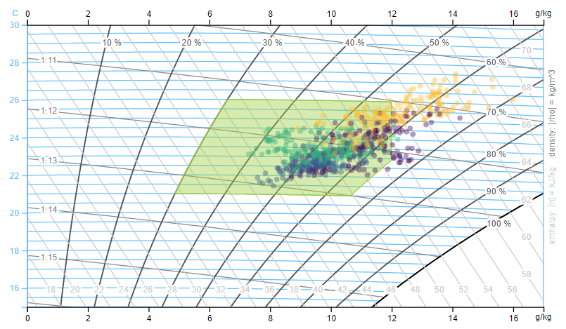

<!-- README.md is generated from README.Rmd. Please edit that file -->

```{r, include = FALSE}
knitr::opts_chunk$set(
  collapse = TRUE,
  comment = "#>",
  fig.path = "man/figures/README-",
  out.width = "100%"
)
```

# redutils - R Energy Data Utilities

<!-- badges: start -->
<!-- badges: end -->

The goal of redutils is to provide useful functions and plots to analyze and visualize energy- and comfort related data. 

## Installation

You can install the package from [GitHub](https://github.com/) with:

``` r
#install.packages("devtools")
#library(devtools)

# close first all R Studio Projects
devtools::install_github("hslu-ige-laes/redutils")
```
The package is not (yet) available on CRAN.

## Functions
### getSeason()
Get the season name out of a date for filter and grouping purposes.

```{r getSeason1, warning=FALSE, message=FALSE}
library(redutils)
x <- as.Date("2019-04-01")
getSeason(x)
```

Default language is English. You can change that by passing the argument `seasonNames`:

```{r getSeason2, warning=FALSE, message=FALSE}
library(redutils)
x <- as.Date("2019-04-01")
getSeason(x, seasonlab = c("Winter","Frühling","Sommer","Herbst"))
```

### getTypEleConsHousehold()
Get a typical electricity consumption of a Swiss household in kWh/year. This is useful to compare a real dataset with a typical consumption value.

```{r getTypEleConsHousehold1, warning=FALSE, message=FALSE}
# single family house
library(redutils)
getTypEleConsHousehold(occupants=3,
                       rooms=5.5,
                       bldgType="single",
                       waterHeater="heatPump",
                       eleCommon="included")
```

```{r getTypEleConsHousehold2, warning=FALSE, message=FALSE}
# flat in a multi family house
library(redutils)
getTypEleConsHousehold(occupants=3,
                       bldgType="multi",
                       freezer="none")
```

Hint: varoius settings can get changed via function arguments.

## Plots
### plotEnergyConsBeforeAfter()
Plot a Graph with Energy Consumption per Month before/after an Optimization.

```{r plotSeasonalXYBeforeAfter, warning=FALSE, message=FALSE}
library(redutils)
data <- readRDS(system.file("sampleData/flatHeatingEnergy.rds", package = "redutils"))
plotSeasonalXYBeforeAfter(data, dateOptimization = "2017-09-01")
```

### plotEnergyConsDailyProfileOverview()
Plot a Graph with Daily Energy Consumption Profiles by Weekday and Season.

```{r plotDailyProfilesOverview, warning=FALSE, message=FALSE}
library(redutils)
data <- readRDS(system.file("sampleData/eboBookEleMeter.rds", package = "redutils"))
plotDailyProfilesOverview(data, locTimeZone = "Europe/Zurich")
```

### plotDailyProfilesDecomposed()
Plot a Graph with Decomposed Daily Energy Consumption Profiles by Weekday. Decomposed means that the trend component (average of 2 week per default) is removed and only the seasonal component is showed. This allows an easier comparison.

```{r plotDailyProfilesdecomposition, warning=FALSE, message=FALSE}
library(redutils)
data <- readRDS(system.file("sampleData/eboBookEleMeter.rds", package = "redutils"))
plotDailyProfilesDecomposed(data, locTimeZone = "Europe/Zurich")
```

### plotMollierHxDiagram()
Plot a D3 Mollier hx Diagram with scatter plot and comfort zone.

```{r plotMollierHxDiagram, echo=FALSE, eval=FALSE}
library(redutils)
data <- readRDS(system.file("sampleData/flatTempHum.rds", package = "redutils"))
plotMollierHx(data)
```


Hint: varoius settings can get changed via function arguments.

<hr>

**Disclaimer**<br>
The authors decline any liability or responsibility in connection with the published documentation

&copy; Lucerne University of Sciences and Arts, 2020
