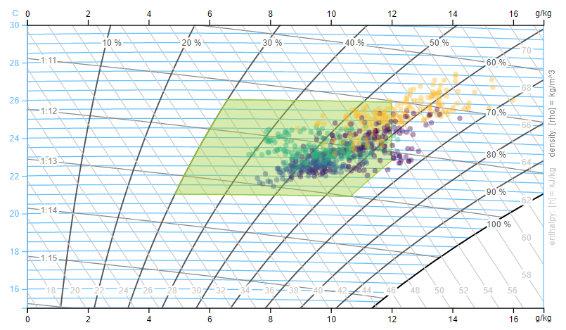

<!-- README.md is generated from README.Rmd. Please edit that file -->

# redutils - R Energy Data Utilities

<!-- badges: start -->

<!-- badges: end -->

The goal of redutils is to provide useful functions to analyze and plots
to visualize energy- and comfort related data.

## Installation

You can install the package from [GitHub](https://github.com/) with:

``` r
#install.packages("devtools")
#library(devtools)

# close first all R Studio Projects
devtools::install_github("hslu-ige-laes/redutils")
```

The package is not (yet) available on CRAN.

## Functions

### getSeason()

Get the season name out of a date for filter and grouping purposes.

``` r
library(redutils)
x <- as.Date("2019-04-01")
getSeason(x)
#> [1] "Spring"
```

Default language is English. You can change that by passing the argument
`seasonNames`:

``` r
library(redutils)
x <- as.Date("2019-04-01")
getSeason(x, seasonNames = c("Winter","Frühling","Sommer","Herbst"))
#> [1] "Frühling"
```

### getTypEleConsHousehold()

Get a typical electricity consumption of a household in kWh/year. This
is useful to compare a real dataset with a typical consumption value.

``` r
# single family house
library(redutils)
getTypEleConsHousehold(occupants=3,
                       rooms=5.5,
                       bldgType="single",
                       waterHeater="heatpump",
                       eleCommon="included")
#> [1] 4800
```

``` r
# flat in a multi family house
library(redutils)
getTypEleConsHousehold(occupants=3,
                       bldgType="multi",
                       freezer="none")
#> [1] 2900
```

Hint: varoius settings can get changed via function arguments.

## Plots

### plotMollierHxDiagram()

Plot a D3 Mollier hx Diagram with scatter plot and comfort zone.

``` r
library(redutils)
data <- readRDS(system.file("sampleData/flatTempHum.rds", package = "redutils"))
plotMollierHx(data)
```



Hint: varoius settings can get changed via function arguments.

<hr>

**Disclaimer**<br> The authors decline any liability or responsibility
in connection with the published documentation

© Lucerne University of Sciences and Arts, 2020
